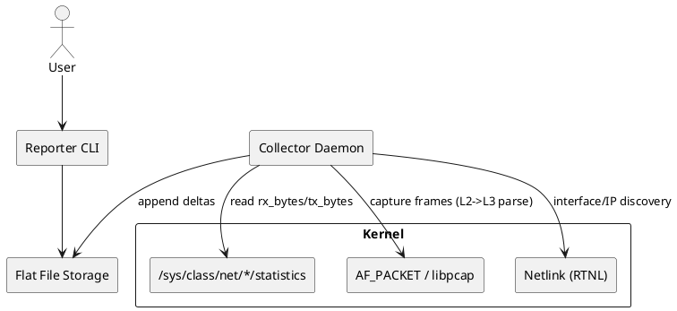

# SPEC-1-Network-Usage-Monitor

## Background

Monitoring network usage on Linux is important in scenarios where bandwidth consumption must be tracked per device or per IP address for accounting, optimization, or cost-control purposes.

The goal of this program is to collect data usage metrics per interface and per IP address with daily and monthly aggregations. Accuracy is key: the system should maintain less than **1% error in total usage**, with slightly higher error tolerances per individual IP address.

The network environment is stable, though it may experience **2–4 reconnections per day**. The system must tolerate these restarts without losing track of overall consumption.

The initial request is to implement the program in **C**, but alternatives in other languages (if significantly simpler or faster to implement while still efficient) are open to consideration.

## Requirements

Following **MoSCoW prioritization**:

### Must Have
- Track **network data usage per interface** (Rx/Tx bytes).
- Track **network data usage per IP address** (Rx/Tx bytes).
- Provide **daily usage reports** per IP and total.
- Provide **monthly usage reports** per IP and total.
- Maintain **<1% error in total usage**, with tolerable higher error for per-IP usage.
- Handle **network restarts (2–4 times/day)** without significant data loss.
- Implement in **C language** (unless a more efficient scripting solution is acceptable).

### Should Have
- Lightweight design (low CPU and memory footprint, comparable to `vnstat`).
- Persistent data storage (across restarts).
- CLI tool to view usage (daily/monthly, per IP/interface).

### Could Have
- Export data in JSON/CSV for external reporting.
- Simple configuration file for choosing interfaces to monitor.
- Optional daemon mode with systemd integration.

### Won’t Have (for MVP)
- Real-time live monitoring UI.
- Distributed/multi-host aggregation.
- Advanced analytics (like per-process traffic).

## Method

### Architecture overview

- **Collector daemon (C)**
  - Gathers per-interface totals from kernel counters.
  - Captures packets to aggregate **per-local-IP** Rx/Tx bytes.
  - Persists incremental deltas to flat files (daily/monthly) with crash-safe writes.
- **Reporter CLI (C)**
  - Reads flat files and prints daily/monthly reports per interface and per IP; supports CSV/JSON.
- **Flat-file storage**
  - Append-only binary records with simple headers; rotation by day/month per interface.



### Key design choices

1. **Per-interface totals**
   - Read 64-bit counters from `/sys/class/net/<iface>/statistics/{rx_bytes,tx_bytes}`.
   - Poll interval: **1s** (configurable). Handle counter **wraparound** and **interface reset** by storing last-seen counters on disk and applying delta logic.

2. **Per-IP accounting (local IPs)**
   - Maintain an in-memory set of **local IPv4/IPv6 addresses** per interface (discovered via **rtnetlink** on startup and on `RTM_NEWADDR/DELADDR` events).
   - Capture packets via **AF_PACKET** using **libpcap** in non-promiscuous mode (only host traffic) with a BPF filter: `ip or ip6`.
   - For each packet, parse L2→L3 headers and classify bytes as:
     - **Tx** for local-src IPs; **Rx** for local-dst IPs.
   - Tally into a hash map keyed by `{iface, IP(version, addr)}` with 64-bit counters.
   - To minimize loss and CPU:
     - Use pcap immediate mode, large ring buffer, and kernel BPF filter.
     - Optional high-performance path later: **TPACKET_V3** or **eBPF/XDP** with a per-IP map (not required for MVP).

3. **Durability and crash safety**
   - Every **N seconds (default 5s)**, flush in-memory deltas to per-interface **daily file** and **monthly file**.
   - Use **fsync** on a small journal file before rotating to main data to avoid losing more than last flush on crash.

4. **Accuracy targets**
   - Total usage relies on kernel interface counters (authoritative), meeting **<1% error** easily.
   - Per-IP uses packet capture; with host-only traffic and 1Gbps or below, dropped packets with tuned buffers should remain very low (<1–2‰). Provide a **dropped-packet metric**; per-IP error may be slightly higher but total remains bound by interface counters.

5. **Handling link flaps (2–4/day)**
   - On `IFF_RUNNING` changes or carrier loss, keep counters in memory and continue; kernel byte counters persist across short link down events.
   - On interface **rename/recreate**, detect via rtnetlink and map by ifindex; if ifindex changes, start a new file segment and document the transition in metadata.

### Data model & file format (flat files)

```
root_dir/
  iface-<name>/
    meta.json        # interface UUID, ifindex history, created_at
    daily/
      2025-09-02.bin
      2025-09-03.bin
    monthly/
      2025-09.bin
```

**Record layout (binary, little-endian)**

- **Daily file header (32 bytes)**
  - magic `NUS1` (4)
  - version u16 (2) => 1
  - reserved (2)
  - day_start_epoch u64 (8) UTC 00:00
  - iface_name[8] (8) zero-terminated (short names) + ifindex u16 (2)
  - checksum header u? (we can omit for MVP)

- **Daily record (per flush)**
  - ts_epoch u32 (flush time)
  - totals: rx_bytes u64, tx_bytes u64 (from kernel deltas)
  - ip_count u16
  - then **ip entries** repeated `ip_count`:
    - ip_version u8 (4 or 6)
    - ip_len u8 (4 or 16)
    - ip_bytes[16]
    - rx_bytes u64
    - tx_bytes u64

- Monthly files aggregate the same structure but with fewer records (one per hour or per flush). Reporter will **sum ranges** to produce per-day or per-month outputs.

> Simplicity: files are append-only; rotation at UTC day/month boundaries. A small **journal** file writes the next record payload before append-commit to make flushes crash-safe.

### Algorithms

1. **Interface delta computation**
```
prev = load_prev(iface)
cur = read_sysfs_bytes()
if cur < prev: // wrap or reset
  delta = cur + 2^64 - prev (or reset detection via uptime)
else
  delta = cur - prev
accumulate(delta)
save_prev(cur)
```

2. **Per-IP tally**
```
packet = next_pcap()
parse L2->L3
if v4 and src in local_v4_set: tx[src]+=len
if v4 and dst in local_v4_set: rx[dst]+=len
(similar for v6)
```

3. **Flush**
```
if now - last_flush >= N:
  write_record(totals_delta, per_ip_deltas)
  zero deltas; keep running totals in memory
```

### Reporter CLI outputs

- `netacct report --iface eth0 --day 2025-09-02`
  - totals Rx/Tx
  - top N IPs (configurable)
  - CSV/JSON export
- `netacct report --month 2025-09` per interface and grand total

### Security & permissions

- Requires `CAP_NET_RAW` (for AF_PACKET) and read access to `/sys/class/net/*/statistics`.
- Optionally install as a systemd service running under a restricted service account.

### Performance targets

- Memory: O(#local IPs) + O(#active IPs seen per flush); for ≤30 IPs this is tiny (<1 MB).
- CPU: pcap with kernel BPF filter keeps CPU use minimal on typical links; no packet copies to user space outside host traffic.

### Extensibility (later)

- Swap libpcap path with **eBPF/XDP** program that counts per local IP in a BPF hash map; user space reads map periodically—lower overhead on high-throughput links.
- Optional REST exporter (read-only) for Prometheus.

## Implementation

This section describes concrete steps, code structure, on-disk layouts, APIs, and operational bits so a contractor team can implement the MVP directly.

### Project layout

```
netacct/                    # repo root
  src/
    main.c                  # entry: parse args, spawn collector + reporter CLI
    collector.c             # packet capture, kernel counters, delta logic
    pcap_if.c               # pcap wrapper + BPF filter management
    nlwatch.c               # rtnetlink watcher for local IPs and interface events
    storage.c               # flat-file append, journal, rotation
    reporter.c              # CLI reporting logic and CSV/JSON export
    util.c                  # helpers: ip parsing, time, config
  include/
    netacct.h
  etc/
    netacct.conf.example
  systemd/
    netacct.service
  Makefile
  README.md
```

### Dependencies

- C compiler (gcc/clang)
- libpcap (for AF_PACKET capture)
- libnl (optional; can also use raw netlink sockets directly) for RTNETLINK monitoring
- zlib (optional) if you want compressed daily files
- POSIX APIs for file I/O, pthreads, timerfd

### Build & install

- Provide a simple `Makefile` producing `netacct` binary and `netacct-report` (same binary with subcommand). Install to `/usr/local/bin` and systemd unit to `/etc/systemd/system/netacct.service`.

### Core modules & API (public C headers)

`netacct.h` (high level)
```c
// config
struct cfg { char **ifaces; int iface_count; int poll_interval; int flush_interval; char *root_dir; };

// initialization
int collector_init(const struct cfg *cfg);
int collector_run();
int reporter_run(int argc, char **argv);
```

### Collector behavior (detailed)

1. **Startup**
   - Read config file (or args) and open `/sys/class/net/<iface>/statistics` for each interface.
   - Open libpcap handle per interface using `af_packet` (pcap_setimmediate_mode, pcap_set_buffer_size) and attach BPF `ip or ip6` (for now `ip` since IPv4 only; change to `ip or ip6` later).
   - Start netlink listener thread to maintain `local_ipv4_set[iface]` and update on address add/remove.

2. **Main loop**
   - Use a dedicated thread for pcap dispatch (pcap_loop with callback) which updates per-IP counters in a lock-protected hash map.
   - Use a timerfd thread for interface polling (1s) to read `/sys/class/net/.../rx_bytes` and `/tx_bytes` and compute deltas.
   - Every `flush_interval` seconds (default 5s), write a binary record to the daily file and append per-ip deltas. Steps:
     - Acquire snapshot of kernel deltas and per-ip hash map.
     - Write a small journal file `journal.tmp` containing the record to be appended.
     - fsync(journal.tmp); rename to `append.bin`; append to final daily file; fsync(daily file); unlink journal.

3. **Rotation**
   - At UTC 00:00 (use local timezone configurable), close current daily file, move to `daily/YYYY-MM-DD.bin` and open new one. Similarly for monthly.

4. **Shutdown**
   - On SIGTERM, do a final flush and fsync, then exit.

### Storage & on-disk semantics (concrete)

- `meta.json` per interface (human readable) contains:
```json
{
  "iface":"eth0",
  "ifindex":2,
  "created_at":1690000000,
  "unit":"bytes"
}
```

- Daily binary record (exact layout)
```c
struct daily_record_header {
  uint32_t ts; // epoch seconds
  uint64_t total_rx_delta;
  uint64_t total_tx_delta;
  uint16_t ip_count;
};
struct ip_entry {
  uint8_t ipv4; // 4
  uint8_t pad;  // alignment
  uint32_t addr; // network byte order
  uint64_t rx_delta;
  uint64_t tx_delta;
};
```
Records are appended sequentially. Reporter reads all records in the date file and sums.

### Reporter CLI (commands)

- `netacct report --iface eth0 --day 2025-09-02 --top 20 --format json`
- `netacct report --iface eth0 --month 2025-09 --format csv`
- `netacct list-ifaces`
- `netacct stats --iface eth0 --since 2025-09-01 --until 2025-09-30`

### Systemd unit (example)

```
[Unit]
Description=NetAcct - lightweight local network accounting
After=network.target

[Service]
Type=simple
ExecStart=/usr/local/bin/netacct daemon --config /etc/netacct.conf
Restart=on-failure
User=netacct
CapabilityBoundingSet=CAP_NET_RAW

[Install]
WantedBy=multi-user.target
```

### Testing & validation plan

- Unit tests for delta math (counter wrap, reset cases).
- Integration test in a VM: generate traffic with iperf between local IPs and remote host; compare kernel `/sys/class/net` deltas to daily file sums.
- Packet-drop stress: generate high pps to ensure pcap doesn’t drop—tune ring buffer. Validate `total per-IP sum` ≤ kernel total (we expect small deficit if some packets dropped); record dropped-packet metric to measure error.

### Safety & edge-cases

- If per-IP sums exceed kernel total due to double-count (rare), clamp values to kernel totals proportionally.
- If interface recreated (ifindex changed), archive old meta and start new series.

### Deliverables for MVP (code + docs)

1. `netacct` daemon (C, ~2500-5000 LOC) that collects and writes daily files.
2. `netacct report` CLI to produce CSV/JSON per-day and per-month summaries.
3. Example `netacct.conf` and systemd unit.
4. Test scripts (iperf + tc) and a short validation report showing error %.
